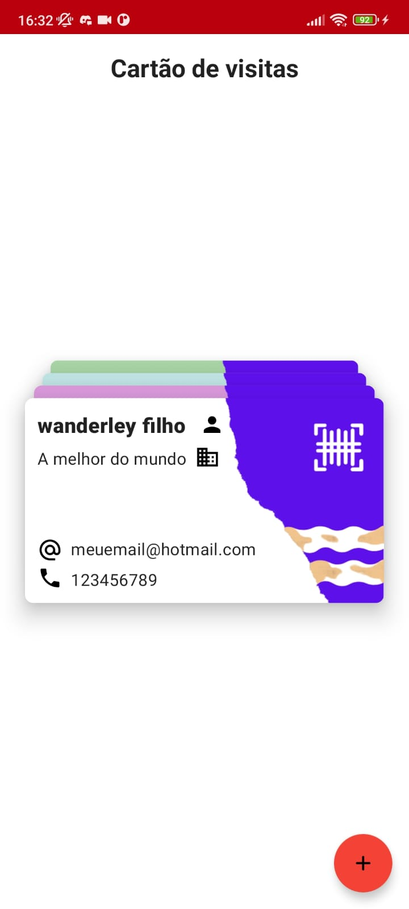
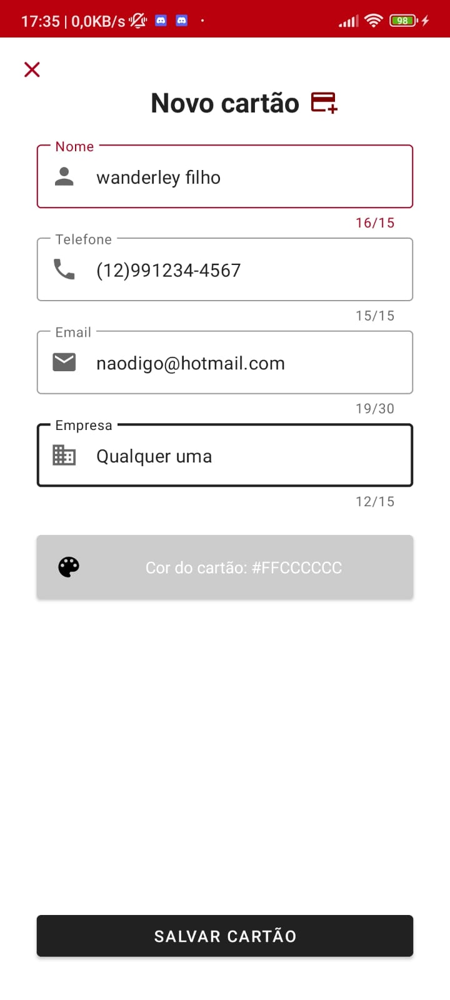
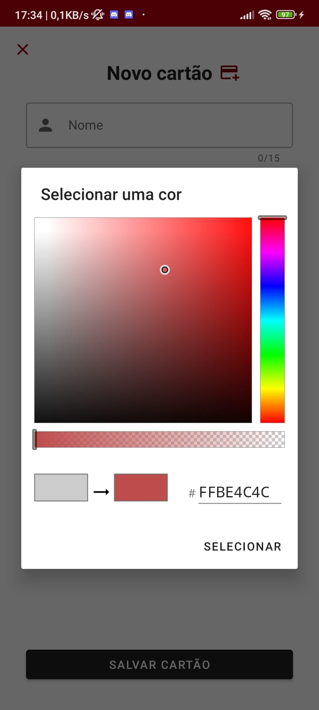
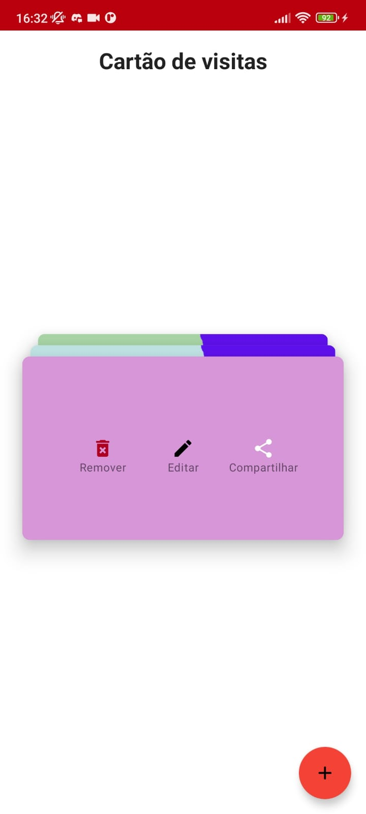

# Solução Desafio Santander Dio Business Card    

## Navegue aqui :3
* [Informações gerais](#informações-gerais)
* [Capturas de tela](#screenshots)
* [Tecnologias](#tecnologia)
* [Setup](#setup)
* [License](#license)

## Informações gerais

Este projeto é parte do desafio do bootcamp da DIO, ofertado pelo Santander,
cujo objetivo era fazer um aplicativo nativo para criação de cards personalizados,
sendo assim, foi desenvolvido em Kotlin (Android Studio), e oferece além de um ótimo design
adaptável tanto para DarkMode tanto para LightMode do seu celular, conta também com animação dos cards.


Em cada card, é possível selecionar entre as configurações **Remover**, **Editar**, **Compartilhar**;
Além disso, quando feito o seu card, ele será salvo na base de dados, e portanto não será apagado
quando sair do aplicativo.

## Screenshots

<p float="left">
  
   
  
  
  
  
</p>

## Tecnologia

#### Linguagens:
- Kotlin 
- Xml

#### Arquitetura usada:
- MVVM

#### Libraries:
- Room      2.3.0 (https://developer.android.com/training/data-storage/room)
- ViewModel,LiveData,lifeCycle 2.3.1 (https://developer.android.com/jetpack/androidx/releases/lifecycle)
- Colorpicker (https://github.com/jaredrummler/ColorPicker)

## Setup

Para rodar esse projeto, instale-o baixando ou clonando o repositório.

#### Requisitos do sistema 
- Ter um computador
- Android Studio Chipmunk | 2021.2.1
- Minimum sdk v21
- Build tool v30.0.3
- Compile sdk v30


## Licença

```html
MIT Licence 

Copyright (c) 2022 Wanderley Filho

Permission is hereby granted, free of charge, to any person obtaining a copy of this software
and associated documentation files (the "Software"), to deal in the Software without restriction,
including without limitation the rights to use, copy, modify, merge, publish, distribute, sublicense,
and/or sell copies of the Software, and to permit persons to whom the Software is furnished to do so, 
subject to the following conditions:

The above copyright notice and this permission notice shall be included in all copies or substantial 
portions of the Software.

THE SOFTWARE IS PROVIDED "AS IS", WITHOUT WARRANTY OF ANY KIND, EXPRESS OR IMPLIED, 
INCLUDING BUT NOT LIMITED TO THE WARRANTIES OF MERCHANTABILITY, FITNESS FOR A PARTICULAR PURPOSE
AND NONINFRINGEMENT.IN NO EVENT SHALL THE AUTHORS OR COPYRIGHT HOLDERS BE LIABLE FOR ANY CLAIM,
DAMAGES OR OTHER LIABILITY, WHETHER IN AN ACTION OF CONTRACT,
TORT OR OTHERWISE, ARISING FROM, OUT OF OR IN CONNECTION WITH THE SOFTWARE
OR THE USE OR OTHER DEALINGS IN THE SOFTWARE.
```
